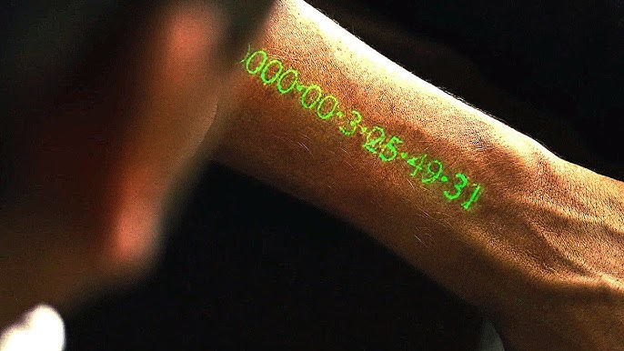

<h1 align="center" style="margin-top: -10px"> Time Vault </h1>

     
   How much do you have? 

Time is the one thing you cannot get more of. I wrote this script to explore formulating this value and presenting it to the user/programmer, to spark thought or motivation, more or less. The source code is just 1 simple python script, and I have no concrete use case for this except for reminding me that I am not going to live forever. Sharing this for anyone to further explore and apply it to something.

## Credits
Written by telekrex.

## License
This project is released into the public domain. See the [LICENSE](LICENSE) file for details.